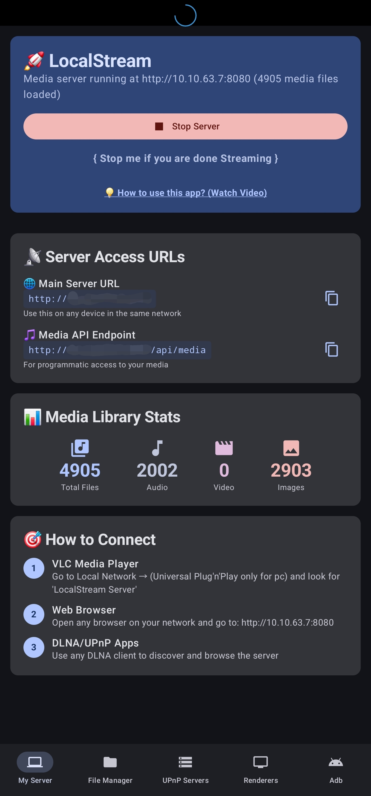
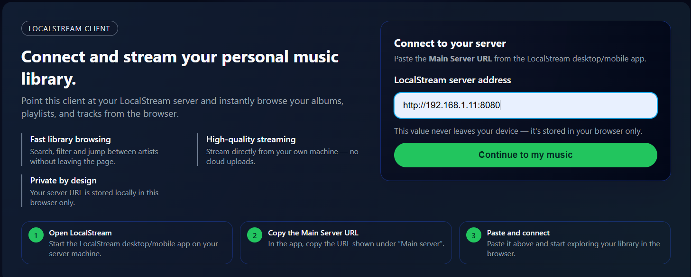
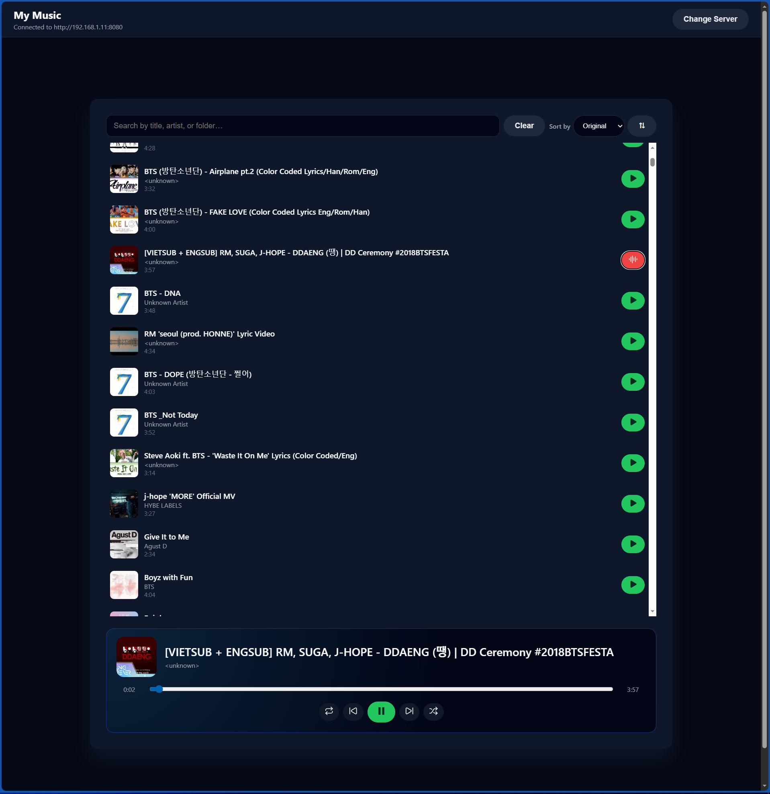

# LocalStream Client

## Purpose

LocalStream Client is a web UI for the LocalStream app that lets you stream your personal music library from a LocalStream server running on your own network. You point the client at your LocalStream server URL, then browse and play your albums, artists, and tracks directly in the browser – no cloud upload required.

Access it here at 
## How to Use

### 1. Install and run LocalStream

- Install the LocalStream app on the device that will host your music library (desktop or phone).
- Open the app and start the server.
- In the LocalStream app, find the **Main Server URL** (for example: `http://192.168.1.11:8080`).

> Download LocalStream for Android: https://play.google.com/store/apps/details?id=com.jeet_studio.localstream4k&hl=en

### 2. Run the LocalStream Client

From this project folder:

1. Install dependencies:
   - `npm install`
2. Start the development server:
   - `npm run dev`
3. Open the URL shown in the terminal (by default `http://localhost:5173`) in your browser.

Or, to run the Node proxy server (if configured):

- `npm start`

### 3. Connect the client to your LocalStream server

1. In your browser, open the LocalStream Client.
2. On the **Connect** page, copy the **Main Server URL** from the LocalStream app.
3. Paste that URL into the **LocalStream server address** field.
4. Click **Continue to my music**.
5. The app will remember this URL in your browser so you dont need to enter it again next time.

### 4. Browse and play your music

- Use the search bar and sort options to quickly find tracks.
- Click a track to start playback.
- Control playback with play/pause, previous/next, shuffle, and repeat.
- Album art is loaded from your LocalStream server, with a sensible default image when artwork isnt available.

## Platform Support

- Audio (music) streaming is supported today.
- **Video & photo support will be available in Summer 2026.**
